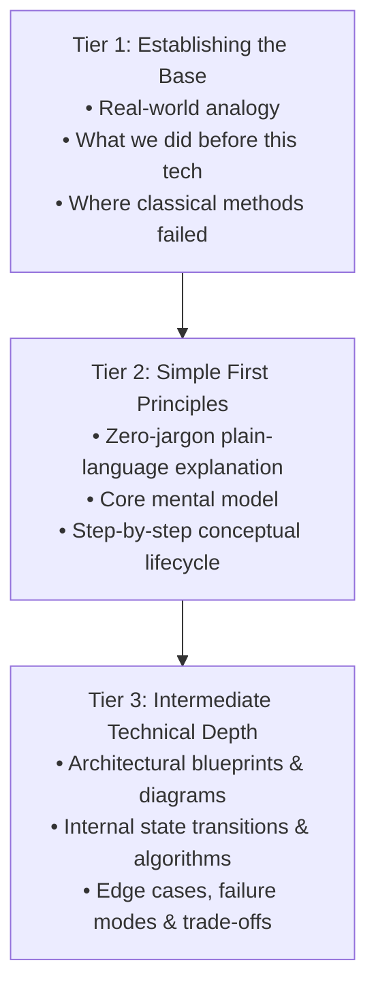

# Implementation Plan: Theory-First CampusX Transformation of GenAI CX Portal

Transform the entire **GenAI CX Learning Hub** (`genai_cx-main`) into a **100% Theory-Based, Code-Free Knowledge Hub** modeled on the signature **CampusX (Nitish Singh)** pedagogical style:
1. **Establishing the Base**: Intuitive real-world hook, everyday analogies, and why classical approaches broke down without this technology.
2. **Simple Explanation**: Plain-language first principles, mental models, and intuitive step-by-step lifecycles without jargon.
3. **Intermediate Technical Depth**: Architectural blueprints, visual state-transition diagrams, data schemas, mathematical intuitions, latency/cost trade-offs, and production failure modes.

## User Review Required

> [!IMPORTANT]
> This transformation removes all Python/code blocks across the `genai_cx-main` portal modules and lessons, replacing them with conceptual step-by-step walkthroughs, structural diagrams, and trade-off tables.

## Proposed Changes & Pedagogical Architecture

### The CampusX 3-Tier Template for Every Module

Each module will be refactored into this standard learning sequence:

---

### Component 1: GenAI Mastery Core Modules (`modules/` & Root Guides)

#### [MODIFY] [`modules/01_foundations.html`](file:///Users/deepankar/Desktop/interview_prep-main/genai_cx-main/modules/01_foundations.html)
- **Base**: Statistical n-gram models vs neural language models; the semantic gap of exact phrase matching.
- **Simple**: The probability lottery machine; tokens as LEGO blocks of meaning; the next-token prediction loop.
- **Intermediate**: Tokenizer vocabulary mapping (BPE), embedding spaces, temperature probability sharpening/flattening, context window attention bounds.

#### [MODIFY] [`modules/02_transformers.html`](file:///Users/deepankar/Desktop/interview_prep-main/genai_cx-main/modules/02_transformers.html)
- **Base**: The "Cocktail Party Problem" - focusing on relevant signals amid background noise.
- **Simple**: Query (what I seek), Key (what you provide), Value (what you actually say) matching intuition.
- **Intermediate**: Scaled Dot-Product Attention derivation, positional encodings (RoPE), Multi-Head attention specialization, Feed-Forward projections.

#### [MODIFY] [`modules/03_local_llms.html`](file:///Users/deepankar/Desktop/interview_prep-main/genai_cx-main/modules/03_local_llms.html)
- **Base**: Cloud API dependencies vs local sovereignty (privacy, cost, offline reliability).
- **Simple**: Encyclopedia compression mental model.
- **Intermediate**: Quantization mechanics (FP16 $\rightarrow$ INT4 / GGUF), KV-cache memory sizing, GPU VRAM vs memory bandwidth throughput constraints.

#### [MODIFY] [`modules/04_embeddings.html`](file:///Users/deepankar/Desktop/interview_prep-main/genai_cx-main/modules/04_embeddings.html)
- **Base**: The geometric coordinate map of human concepts.
- **Simple**: Why directional relationships ("King - Man + Woman = Queen") exist in semantic space.
- **Intermediate**: Dense vs Sparse embeddings, Bi-encoders vs Cross-encoders, Cosine similarity vs Euclidean distance in high-dimensional manifolds.

#### [MODIFY] [`modules/05_vector_databases.html`](file:///Users/deepankar/Desktop/interview_prep-main/genai_cx-main/modules/05_vector_databases.html)
- **Base**: The library with 10 million unlabeled books.
- **Simple**: Why linear search ($O(N)$) fails and how highway-road hierarchical navigation accelerates search.
- **Intermediate**: HNSW graph skip-list algorithms, IVF Voronoi cell clustering, Vector Quantization (PQ), and metadata filtering strategies.

#### [MODIFY] [`rag-deep-dive.html`](file:///Users/deepankar/Desktop/interview_prep-main/genai_cx-main/rag-deep-dive.html)
- **Base**: Open-book vs closed-book exams for AI.
- **Simple**: The 5-stage pipeline: Chunk $\rightarrow$ Embed $\rightarrow$ Retrieve $\rightarrow$ Augment $\rightarrow$ Generate.
- **Intermediate**: Chunking trade-offs (Fixed, Recursive, Semantic), Hybrid Search (Reciprocal Rank Fusion), Reranking models, Parent-Document & Graph RAG architectures, and Ragas evaluation metrics.

#### [MODIFY] [`modules/08_agents.html`](file:///Users/deepankar/Desktop/interview_prep-main/genai_cx-main/modules/08_agents.html)
- **Base**: Moving from a pure calculator (LLM) to an assistant with hands and eyes (Tools & Environment).
- **Simple**: The ReAct cycle (Observation $\rightarrow$ Thought $\rightarrow$ Action).
- **Intermediate**: Planning patterns (Plan-and-Solve, Reflection), tool boundary validation, state maintenance, and infinite loop failure modes.

#### [MODIFY] [`modules/09_mcp.html`](file:///Users/deepankar/Desktop/interview_prep-main/genai_cx-main/modules/09_mcp.html)
- **Base**: The USB-C standard for AI tooling (eliminating $M \times N$ custom integration spaghetti).
- **Simple**: Client, Host, and Server roles explained through an operating system peripheral model.
- **Intermediate**: Protocol primitives (Tools, Resources, Prompts), JSON-RPC transport layers, security sandboxing, and capability negotiation.

#### [MODIFY] [`modules/10_langchain.html`](file:///Users/deepankar/Desktop/interview_prep-main/genai_cx-main/modules/10_langchain.html)
- **Base**: Unix pipeline orchestration (`cat | grep | cut`) reimagined for language models.
- **Simple**: Why modular building blocks simplify chain construction.
- **Intermediate**: Runnable interface lifecycle, streaming protocols, batch execution semantics, and framework abstraction costs.

#### [MODIFY] [`modules/11_llamaindex.html`](file:///Users/deepankar/Desktop/interview_prep-main/genai_cx-main/modules/11_llamaindex.html)
- **Base**: Transforming unstructured knowledge silos into indexed query graphs.
- **Simple**: Document $\rightarrow$ Node $\rightarrow$ Index structural hierarchy.
- **Intermediate**: Tree indexing, sub-question query decomposition, router engines, and metadata-aware retrieval algorithms.

#### [MODIFY] [`modules/12_langgraph.html`](file:///Users/deepankar/Desktop/interview_prep-main/genai_cx-main/modules/12_langgraph.html)
- **Base**: Why real software requires loops, retries, and branches (the limits of linear DAGs).
- **Simple**: A state machine board game: nodes as players, edges as transition rules, state as the board.
- **Intermediate**: State schemas, Reducers, Checkpointing, Time-travel replay, and Human-in-the-loop pause/resume semantics.

#### [MODIFY] [`langgraph-asyncio.html`](file:///Users/deepankar/Desktop/interview_prep-main/genai_cx-main/langgraph-asyncio.html)
- **Base**: The restaurant kitchen analogy (waiting for the oven vs preparing side dishes).
- **Simple**: Concurrency vs Parallelism in network-bound AI workflows.
- **Intermediate**: Event loop mechanics, cooperative multitasking, coroutines, backpressure semaphores, and structured task cancellation.

#### [MODIFY] [`langgraph-pydantic.html`](file:///Users/deepankar/Desktop/interview_prep-main/genai_cx-main/langgraph-pydantic.html)
- **Base**: The airport customs gate (converting unstructured luggage into verified passenger records).
- **Simple**: Why LLM text is inherently untyped and how schemas create reliable software contracts.
- **Intermediate**: Schema validation theory, Discriminated Unions for routing, and self-healing LLM retry loops.

#### [MODIFY] [`modules/13_multi_agents.html`](file:///Users/deepankar/Desktop/interview_prep-main/genai_cx-main/modules/13_multi_agents.html)
- **Base**: Company organization charts (delegating specialized tasks vs overloading one generalist).
- **Simple**: Supervisor-Worker, Peer-to-Peer, and Hierarchical agent topologies.
- **Intermediate**: Agent-to-Agent (A2A) protocols, shared state vs message passing, consensus mechanisms, and conflict resolution.

#### [MODIFY] [`modules/14_production_genai.html`](file:///Users/deepankar/Desktop/interview_prep-main/genai_cx-main/modules/14_production_genai.html)
- **Base**: Bridging the gap from a 70% prototype to a 99.9% Production SLA.
- **Simple**: The 5 Production Pillars: Latency, Cost, Quality, Security, Observability.
- **Intermediate**: Semantic vs Exact caching, prompt caching, model cascading, rate limiting (Token Bucket), circuit breakers, and PII guardrails.

#### [MODIFY] [`modules/15_capstone_projects.html`](file:///Users/deepankar/Desktop/interview_prep-main/genai_cx-main/modules/15_capstone_projects.html)
- **Base**: 10 Real-World Enterprise System Blueprints.
- **Simple**: High-level problem statements, user journeys, and component interactions.
- **Intermediate**: Detailed architecture diagrams, data flow pipelines, latency/cost budgets, threat models, and failure recovery matrices.

---

### Component 2: Understanding AI Agents Course (`teach-agents/lessons/`)

#### [MODIFY] [`teach-agents/lessons/0001-llm-mechanics.html` to `0015-capstone.html`](file:///Users/deepankar/Desktop/interview_prep-main/genai_cx-main/teach-agents/lessons/0001-llm-mechanics.html)
- Transform all 15 lessons to eliminate script blocks, replacing them with interactive mental models, state machines, and system reasoning drills covering agent loops, tools, reasoning, retrieval, memory, safety, evaluations, tracing, and multi-agent coordination.

---

### Component 3: Deep Dives (`agent-protocols.html`, `llm-evals.html`, `llmops.html`, `langfuse.html`, `guardrails.html`, `memory.html`, `langgraph.html`, `claude-agent.html`, `hermes.html`)

#### [MODIFY] Deep Dive Pages
- Refactor all 9 deep dive guides to focus exclusively on foundational theory, architecture comparisons, lifecycle graphs, and senior engineering interview mental models.

---

## Verification Plan

### Content Verification
- Ensure every lesson and module follows the 3-tier CampusX pedagogy.
- Verify zero `<pre><code>` code blocks remain across the `genai_cx-main` modules and deep dives.
- Validate that all code snippets are cleanly replaced with diagrams, tables, and conceptual walkthroughs.

### System & Layout Verification
- Verify responsive layout, right-rail TOC anchors, and dark/light mode rendering.
- Run link verification across all 116+ pages to confirm zero 404s.
